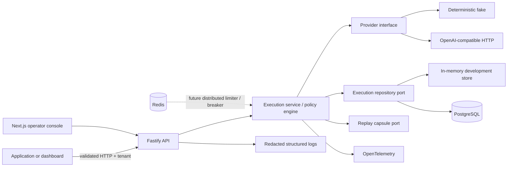

# Reliability Lab

Reliability Lab is a serious prototype for putting policy, observability, and deterministic incident
replay between an application and OpenAI-compatible LLM providers. Its working slice accepts a
tenant-scoped execution, applies bounded retry and fallback policy, validates structured output,
records versioned append-only events, and exposes the outcome through an API and operator dashboard.

Replayable incidents matter because a provider failure is rarely explained by the final HTTP status
alone. A safe execution envelope captures the route, attempts, normalized failures, policy
decisions, timing, trace correlation, and—only when retention permits—a canonical replay capsule.
That lets engineers reproduce a production-shaped failure without pretending that every live prompt
is safe to retain.

## Current status

Implemented now:

- strict shared TypeScript contracts and a discriminated, versioned event union
- injectable policy engine with bounded exponential backoff and jitter, retry, fallback, latency
  budgets, JSON Schema output validation, in-memory rate limiter, and in-memory circuit breaker
- deterministic fake provider and a narrow OpenAI-compatible HTTP adapter
- tenant-scoped Fastify API with TypeBox validation, idempotency, OpenAPI, Swagger UI, replay, and
  redacted Pino logging
- Drizzle PostgreSQL schema, migration, and repository for executions, attempts, events, and
  idempotency records
- OpenTelemetry spans with console export by default and optional OTLP export
- Next.js operator console with execution list/detail, attempt summaries, event timeline, replay
  control, and development failure-injection form
- guarded repository and working-file export tools

Not implemented as production infrastructure: distributed circuit state, global rate limiting,
durable/encrypted replay capsules, authentication/authorization beyond the prototype tenant header,
queue workers, cost enforcement, or a multi-replica consistency model. Redis adapters are explicit
unwired skeletons. Replay capsules remain process-local even when execution metadata uses Postgres.

## Architecture



Domain code has no Fastify, Next.js, Drizzle, Redis, or provider-SDK dependency. See
[`docs/architecture.md`](docs/architecture.md) for trust boundaries and scaling direction.

## Execution lifecycle

1. The API validates the body and `X-Tenant-Id`, hashes the canonical request, and checks the
   tenant/idempotency-key pair.
2. The execution service records `execution.accepted`, creates the envelope, and chooses a provider
   through the injected registry.
3. Each call records `attempt.started`; retryable errors use bounded exponential backoff with
   injected time and randomness.
4. A configured fallback runs once after primary policy exhaustion and makes a successful outcome
   `degraded`.
5. Structured output is validated with Ajv. Invalid output records a rejection and fails the
   execution.
6. Terminal state, attempts, and normalized metadata are persisted; events remain append-only.
7. Fake requests retain an in-process replay capsule. Replay creates a linked execution and records
   replay start/completion events. Live requests default to non-replayable.

## Repository layout

```text
apps/api          Fastify composition root, routes, injection tests
apps/web          Next.js App Router console and Playwright smoke test
packages/contracts  TypeBox schemas and shared domain contracts
packages/core       Policy engine, ports, in-memory adapters
packages/providers  Fake and OpenAI-compatible providers
packages/db         Drizzle schema, migration, PostgreSQL repository
packages/observability  OpenTelemetry bridge and log redaction
packages/testkit    Deterministic clocks, IDs, and randomness
docs/               Architecture, envelope, failure, security, ADRs
scripts/            Guarded export commands and tests
.agents/skills/     Repository-local export skill instructions
```

## Quick start

Requirements: Node 24 LTS, pnpm 11.17.0 via Corepack, Docker with Compose for the persistent path.

```bash
corepack enable
pnpm install
cp .env.example .env
pnpm dev:infra
pnpm db:migrate
ENABLE_FAILURE_INJECTION=true pnpm dev
```

The development tenant is the transparent header value `demo-tenant`; no tenant row is seeded.
Without `DATABASE_URL` and `REDIS_URL`, the API runs with process-local execution storage and reports
those modes at `/readyz`. The `.env` file is ignored and must never contain production credentials.

- Dashboard: <http://localhost:3000>
- API: <http://localhost:4000>
- Swagger UI: <http://localhost:4000/docs>
- OpenAPI JSON: <http://localhost:4000/openapi.json>

## Demo requests

All examples require `ENABLE_FAILURE_INJECTION=true` except the first and replay.

Successful execution:

```bash
curl -sS http://localhost:4000/v1/executions \
  -H 'content-type: application/json' \
  -H 'x-tenant-id: demo-tenant' \
  -H 'idempotency-key: demo-success-1' \
  -d '{"provider":"fake-primary","model":"deterministic-v1","input":"Summarize incident 42"}'
```

Retry once after a rate limit:

```bash
curl -sS http://localhost:4000/v1/executions \
  -H 'content-type: application/json' -H 'x-tenant-id: demo-tenant' \
  -d '{"provider":"fake-primary","model":"deterministic-v1","input":"retry","failureMode":"rate_limit","policy":{"maxAttempts":2,"baseBackoffMs":10,"maxBackoffMs":10,"jitterRatio":0}}'
```

Fallback and a `degraded` terminal status:

```bash
curl -sS http://localhost:4000/v1/executions \
  -H 'content-type: application/json' -H 'x-tenant-id: demo-tenant' \
  -d '{"provider":"fake-primary","model":"deterministic-v1","input":"fallback","failureMode":"provider_error","policy":{"maxAttempts":1,"fallbackProvider":"fake-fallback","fallbackModel":"deterministic-v1"}}'
```

Malformed structured output:

```bash
curl -sS http://localhost:4000/v1/executions \
  -H 'content-type: application/json' -H 'x-tenant-id: demo-tenant' \
  -d '{"provider":"fake-primary","model":"deterministic-v1","input":"structured","failureMode":"malformed_json","structuredOutputSchema":{"type":"object","required":["result"],"properties":{"result":{"type":"string"}}}}'
```

Replay (replace the ID):

```bash
curl -sS -X POST http://localhost:4000/v1/executions/EXECUTION_ID/replay \
  -H 'x-tenant-id: demo-tenant'
```

Inspect with `GET /v1/executions` or `GET /v1/executions/:executionId`, always with
`X-Tenant-Id`.

## Commands

| Command                                       | Purpose                                                      |
| --------------------------------------------- | ------------------------------------------------------------ |
| `pnpm dev`, `dev:api`, `dev:web`              | Run both apps or one app                                     |
| `pnpm dev:infra`                              | Start healthy Postgres and Redis services                    |
| `pnpm build`                                  | Build every workspace package                                |
| `pnpm lint`, `format:check`, `typecheck`      | Static checks                                                |
| `pnpm test:unit`                              | Docker-independent policy, provider, API, and export tests   |
| `pnpm test:integration`                       | PostgreSQL repository test; requires migrated `DATABASE_URL` |
| `pnpm test:e2e`                               | Dashboard list/detail smoke flow; requires the API           |
| `pnpm verify`                                 | Format, lint, typecheck, unit tests, build                   |
| `pnpm verify:full`                            | Verify plus integration and browser tests                    |
| `pnpm audit:deps`, `audit:unused`, `audit`    | Read-only dependency/dead-code observation                   |
| `pnpm db:generate`, `db:migrate`, `db:studio` | Drizzle workflows                                            |
| `pnpm export:repo`, `export:working`          | Guarded compressed exports                                   |

## Testing strategy

Unit tests inject clocks, IDs, randomness, provider responses, and repositories; they do not require
Docker or real delays. Fastify injection covers validation, tenant isolation, idempotency, OpenAPI,
inspection, and replay. The PostgreSQL integration test verifies persistence when infrastructure is
available. Playwright creates an API execution and follows the dashboard into its event timeline.
There are deliberately no broad snapshots.

## Observability

The service creates spans for policy evaluation, provider attempts, structured-output validation,
persistence creation, and replay-driven execution. Local development exports spans to the console;
setting `OTEL_EXPORTER_OTLP_ENDPOINT` switches to OTLP/HTTP. Each envelope and API submission
contains a 32-character trace correlation ID, and logs include it with the execution ID and tenant.
Prompt bodies and messages are excluded from span attributes and redacted from Pino records.

## Security and retention

Tenant filtering is enforced in repository reads and idempotency keys are scoped by tenant, but the
prototype header is not authentication. Authorization, cookies, API keys, messages, and input use
log-redaction paths. OpenAI-compatible keys stay inside the HTTP adapter. Fake executions retain
canonical input in a process-local capsule. Live retention defaults off; the API returns an explicit
non-replayable result. No faux encryption is present. See
[`docs/security-and-retention.md`](docs/security-and-retention.md).

## Design tradeoffs

- Execution is synchronous to keep the first slice inspectable; a queue would change submission and
  cancellation semantics.
- Events are append-only, while the execution row is a query projection updated to its latest state.
- The memory repository keeps unit tests and an infrastructure-free demo honest, but is not shared
  or durable.
- The narrow live adapter avoids SDK/domain coupling but supports only chat completions and focused
  JSON Schema response formatting.
- Replay capsules are intentionally ephemeral until encrypted durable retention has a threat model
  and key-rotation design.

## Production-hardening direction

- **Identity and tenancy:** authenticated principals, tenant membership, database row-level security,
  service-to-service authorization.
- **Execution consistency:** durable queue, transactional outbox, concurrency-safe idempotency,
  cancellation, leases, and recovery.
- **Policy controls:** Redis-backed distributed rate limits and circuit state, model/provider health,
  cost budgets, and explicit policy versions.
- **Replay storage:** managed encrypted blobs or AES-256-GCM field encryption with envelope keys,
  rotation, deletion, access auditing, and residency controls.
- **Observability:** sampled OTLP pipelines, metrics, baggage policy, log/trace joining, and SLOs.
- **Operations:** multi-replica readiness, migration automation, backups, restore exercises, and
  incident runbooks.

## Export skills

Ask Codex to use `$export-repo` to package all tracked and non-ignored non-secret files. The skill
runs `pnpm export:repo -- --dry-run` before creating `artifacts/exports/*.tar.gz`.

Ask Codex to use `$export-working-files` only for intentionally ignored artifacts. Add sanitized
paths to `.working-files.export.json`, then the skill dry-runs and exports only that allowlist.
Environment files, keys, credentials, browser profiles, databases, raw prompts, and user data are
always refused.

## Known limitations

The API executes inline; in-flight state cannot survive process loss. Replay capsules are not stored
in Postgres and disappear on restart. Readiness checks configured dependencies but does not validate
schema version. Redis implementations are skeletons only. The dashboard uses the demo tenant and has
no login. Live-provider behavior is not exercised by the default test suite. Cost is normalized but
not enforced. The circuit breaker is deliberately simple and process-local.
