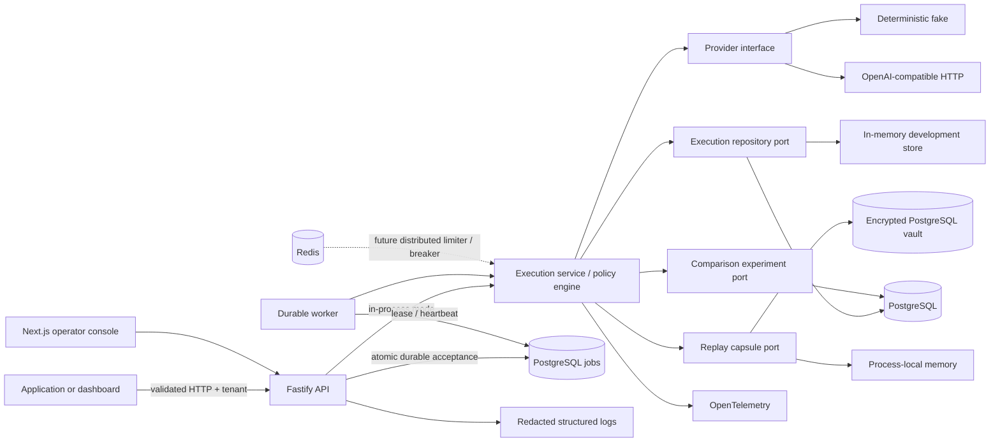

# Reliability Lab

Reliability Lab is a serious prototype for putting policy, observability, and deterministic
execution replay between an application and OpenAI-compatible LLM providers. Its working slice accepts a
tenant-scoped execution, applies bounded retry and fallback policy, validates structured output,
records versioned append-only events, and exposes the outcome through an API and operator dashboard.

Replayable investigation cases matter because a provider failure is rarely explained by the final
HTTP status alone. A safe execution envelope captures the route, attempts, normalized failures, policy
decisions, timing, trace correlation, and—only when retention permits—a canonical replay capsule.
That lets engineers reproduce a production-shaped failure without pretending that every live prompt
is safe to retain.

## Current status

Implemented now:

- strict shared TypeScript contracts and a discriminated, versioned event union
- injectable policy engine with bounded exponential backoff and jitter, retry, fallback, latency
  budgets, JSON Schema output validation, in-memory rate limiter, and in-memory circuit breaker
- deterministic fake provider and a narrow OpenAI-compatible HTTP adapter
- tenant-scoped Fastify API with immediate `202` acceptance, persisted-event SSE with cursor resume,
  TypeBox validation, idempotency, OpenAPI, Swagger UI, replay, and redacted Pino logging
- Drizzle PostgreSQL schema, migration, and repository for executions, attempts, events, and
  idempotency records
- tenant-scoped PostgreSQL Replay Vault with AES-256-GCM encryption, expiry, deletion,
  metadata-only lifecycle audit, and read-old/write-current key versions
- OpenTelemetry spans with console export by default and optional OTLP export
- Next.js operator console with a live evidence-driven machine view, incremental event timeline,
  recorded-history playback, replay control, guided comparative replay variants, side-by-side
  machines, and dimension-level evidence comparisons
- tenant-scoped, versioned comparison experiments persisted in memory or PostgreSQL, with requested
  overrides, resolved non-sensitive conditions, linked variant executions, and read-time projections
- explicit `in_process` and `postgres_worker` execution modes; durable mode atomically accepts
  executions, idempotency records, encrypted transient commands, and comparison variants
- separate PostgreSQL worker with exclusive leases, heartbeats, bounded concurrency, safe reclaim,
  terminal reconciliation, conservative provider-call ambiguity, and command-payload cleanup
- guarded repository and working-file export tools

Not implemented as production infrastructure: managed KMS/envelope encryption, authenticated replay
actors, authentication/authorization beyond the prototype tenant header, distributed circuit state,
global rate limiting, cancellation, resumable ambiguous provider calls, cost enforcement, physical
backup erasure, or a multi-replica consistency model. Redis adapters remain explicit unwired
skeletons.

## Architecture



Domain code has no Fastify, Next.js, Drizzle, Redis, or provider-SDK dependency. See
[`docs/architecture.md`](docs/architecture.md) for trust boundaries and scaling direction and the
outcome-based [`docs/roadmap.md`](docs/roadmap.md) for what comes next.

Plain-language guides:

- [Reliability Lab basics](docs/reliability-lab-basics.md)
- [Comparative Replay basics](docs/reliability-lab-comparative-replay-basics.md)
- [Durable Execution basics](docs/reliability-lab-durable-execution-basics.md)

## Execution lifecycle

1. The API validates the body and `X-Tenant-Id`, hashes the canonical request, and selects the
   explicit execution mode.
2. In default `in_process` mode, it persists acceptance and continues asynchronously in the API
   process.
3. In `postgres_worker` mode, one transaction persists the queued envelope, accepted/queued events,
   encrypted transient command, and optional concurrency-safe idempotency record before `202`.
4. A separate worker claims the job under an exclusive lease, heartbeats it, decrypts the command,
   and invokes the same core continuation engine.
5. The engine retains replay material independently when policy permits, resolves the provider, and
   records `attempt.started` before provider work. Failed attempts record normalized evidence before
   retry, fallback, or stop.
6. A configured fallback runs once after primary policy exhaustion and makes a successful outcome
   `degraded`.
7. Structured output is validated with Ajv. Requested validation records either success or
   rejection; invalid output fails the execution.
8. Terminal state, attempts, and normalized metadata are persisted; events remain append-only. The
   worker marks safe terminal job metadata and clears command ciphertext, nonce, and tag.
9. Eligible requests retain a tenant-scoped capsule with explicit expiry. Memory mode is
   process-local; PostgreSQL mode encrypts before persistence and appends lifecycle audit metadata.
10. Tenant-scoped SSE reads events after a sequence cursor from persisted evidence, backfills
    history, sends heartbeats while following, and closes after terminal evidence.
11. Reads hydrate current replay capability, so expiry, deletion, missing keys, or unreadable data
    disable replay. Replay creates a linked execution and records replay start/completion events.
12. Comparative replay resolves a bounded variation against retained input. Durable mode atomically
    commits the variant, linkage events, job, and experiment, then compares the terminal envelopes.

## Repository layout

```text
apps/api          Fastify composition root, routes, injection tests
apps/worker       PostgreSQL lease/heartbeat polling and durable continuation
apps/web          Next.js App Router console and durable Playwright flow
packages/contracts  TypeBox schemas and shared domain contracts
packages/core       Policy engine, ports, in-memory adapters
packages/providers  Fake and OpenAI-compatible providers
packages/db         Drizzle schema, migration, PostgreSQL repository
packages/observability  OpenTelemetry bridge and log redaction
packages/testkit    Deterministic clocks, IDs, and randomness
docs/               Architecture, envelope, failure, security, ADRs
scripts/            Guarded export commands and tests
.agents/skills/     Repository-local export skill instructions
```

## Quick start

Requirements: Node 24 LTS, pnpm 11.17.0 via Corepack, Docker with Compose for the persistent path.

```bash
corepack enable
pnpm install
cp .env.example .env
pnpm dev:infra
pnpm db:migrate
ENABLE_FAILURE_INJECTION=true pnpm dev
```

The development tenant is the transparent header value `demo-tenant`; no tenant row is seeded.
Without `DATABASE_URL` and `REDIS_URL`, the API runs with process-local execution and replay storage
and reports those modes at `/readyz`. To exercise restart-durable replay, set
`REPLAY_CAPSULE_STORE=postgres`, a valid active key version/keyring, and `DATABASE_URL`, then migrate
before starting the API. The public keys in `.env.example` are intentionally unsafe examples; do not
reuse them. The `.env` file is ignored and must never contain production credentials.

For restart-durable execution, set `EXECUTION_MODE=postgres_worker`,
`REPLAY_CAPSULE_STORE=postgres`, and valid independent command/replay keyrings, then run:

```bash
pnpm db:migrate
pnpm dev:durable
```

The API is on port 4000, the worker exposes process health on port 4001, and the web console is on
port 3000. Durable mode fails closed rather than falling back to in-process continuation.

- Dashboard: <http://localhost:3000>
- API: <http://localhost:4000>
- Swagger UI: <http://localhost:4000/docs>
- OpenAPI JSON: <http://localhost:4000/openapi.json>

## Demo requests

All examples require `ENABLE_FAILURE_INJECTION=true` except the first and replay.

Successful execution:

```bash
curl -sS http://localhost:4000/v1/executions \
  -H 'content-type: application/json' \
  -H 'x-tenant-id: demo-tenant' \
  -H 'idempotency-key: demo-success-1' \
  -d '{"provider":"fake-primary","model":"deterministic-v1","input":"Summarize execution 42"}'
```

Retry once after a rate limit:

```bash
curl -sS http://localhost:4000/v1/executions \
  -H 'content-type: application/json' -H 'x-tenant-id: demo-tenant' \
  -d '{"provider":"fake-primary","model":"deterministic-v1","input":"retry","failureMode":"rate_limit","policy":{"maxAttempts":2,"baseBackoffMs":10,"maxBackoffMs":10,"jitterRatio":0}}'
```

Fallback and a `degraded` terminal status:

```bash
curl -sS http://localhost:4000/v1/executions \
  -H 'content-type: application/json' -H 'x-tenant-id: demo-tenant' \
  -d '{"provider":"fake-primary","model":"deterministic-v1","input":"fallback","failureMode":"provider_error","policy":{"maxAttempts":1,"fallbackProvider":"fake-fallback","fallbackModel":"deterministic-v1"}}'
```

Malformed structured output:

```bash
curl -sS http://localhost:4000/v1/executions \
  -H 'content-type: application/json' -H 'x-tenant-id: demo-tenant' \
  -d '{"provider":"fake-primary","model":"deterministic-v1","input":"structured","failureMode":"malformed_json","structuredOutputSchema":{"type":"object","required":["result"],"properties":{"result":{"type":"string"}}}}'
```

Replay (replace the ID):

```bash
curl -sS -X POST http://localhost:4000/v1/executions/EXECUTION_ID/replay \
  -H 'x-tenant-id: demo-tenant'
```

Comparative replay with fewer primary attempts and immediate fallback:

```bash
curl -sS -X POST http://localhost:4000/v1/executions/EXECUTION_ID/comparisons \
  -H 'content-type: application/json' -H 'x-tenant-id: demo-tenant' \
  -d '{"variation":{"policy":{"maxAttempts":1,"fallbackProvider":"fake-fallback","fallbackModel":"deterministic-v1"}}}'

curl -sS http://localhost:4000/v1/comparisons/EXPERIMENT_ID \
  -H 'x-tenant-id: demo-tenant'
```

Comparison requests cannot replace input or messages. Omitted controls inherit original conditions;
supported `null` values explicitly remove fallback or cost limits, and a no-op requires
`reproducibilityCheck: true`.

Delete retained replay data idempotently:

```bash
curl -sS -X DELETE http://localhost:4000/v1/executions/EXECUTION_ID/replay-capsule \
  -H 'x-tenant-id: demo-tenant'
```

Inspect with `GET /v1/executions` or `GET /v1/executions/:executionId`, always with
`X-Tenant-Id`. Execution detail includes `replayCapability` with current state, safe reason, and
expiry/deletion timestamps when applicable; capsule content and cryptographic fields are never
returned.

Follow persisted events with a reconnectable cursor:

```bash
curl -N 'http://localhost:4000/v1/executions/EXECUTION_ID/events?after=0' \
  -H 'accept: text/event-stream' \
  -H 'x-tenant-id: demo-tenant'
```

The stream contains operator-safe typed events only: never prompt text, replay capsules,
cryptographic material, provider credentials, authorization, or cookies.

## Replay configuration

| Variable                            | Behavior                                                        |
| ----------------------------------- | --------------------------------------------------------------- |
| `REPLAY_CAPSULE_STORE`              | `memory` (default) or explicit `postgres` durable vault         |
| `REPLAY_CAPSULE_RETENTION_HOURS`    | Positive retention duration; defaults to 24                     |
| `REPLAY_CAPSULE_ACTIVE_KEY_VERSION` | Key version used for new PostgreSQL capsule writes              |
| `REPLAY_CAPSULE_KEYS_JSON`          | Prototype JSON map of versions to base64-encoded 32-byte keys   |
| `ALLOW_LIVE_PROMPT_RETENTION`       | Defaults false; true requires a valid PostgreSQL vault at start |

Old rows use their stored key version while new rows use the active version. Keep historical keys
configured until their rows expire or are deleted. Environment-variable keys are not production KMS
or full envelope encryption.

## Durable execution configuration

| Variable                               | Behavior                                                 |
| -------------------------------------- | -------------------------------------------------------- |
| `EXECUTION_MODE`                       | `in_process` (default) or explicit `postgres_worker`     |
| `EXECUTION_COMMAND_ACTIVE_KEY_VERSION` | Key version used for new transient command writes        |
| `EXECUTION_COMMAND_KEYS_JSON`          | Independent map of base64-encoded 32-byte command keys   |
| `WORKER_ID`                            | Optional identity; a unique local value is generated     |
| `WORKER_CONCURRENCY`                   | Bounded parallel claims, 1–16; defaults to 1             |
| `WORKER_POLL_INTERVAL_MS`              | Bounded idle polling interval; defaults to 250 ms        |
| `WORKER_LEASE_DURATION_MS`             | Lease duration; defaults to 30 seconds                   |
| `WORKER_HEARTBEAT_INTERVAL_MS`         | Heartbeat interval, which must be shorter than the lease |
| `WORKER_HEALTH_PORT`                   | Local worker process-health port; defaults to 4001       |

Worker mode also requires `DATABASE_URL`, a migrated schema, and PostgreSQL Replay Vault
configuration so replay capabilities are shared across API and worker processes. Command and replay
keyrings are intentionally separate. Both environment keyrings are prototype key management, not
KMS.

## Commands

| Command                                          | Purpose                                                 |
| ------------------------------------------------ | ------------------------------------------------------- |
| `pnpm dev`, `dev:api`, `dev:web`                 | Run infrastructure-free mode or one app                 |
| `pnpm dev:durable`, `dev:worker`, `start:worker` | Run durable local mode or the separate worker           |
| `pnpm dev:infra`                                 | Start healthy Postgres and Redis services               |
| `pnpm build`                                     | Build every workspace package                           |
| `pnpm lint`, `format:check`, `typecheck`         | Static checks                                           |
| `pnpm test:unit`                                 | Docker-independent focused tests                        |
| `pnpm test:integration`                          | PostgreSQL repository/job tests; requires migrated DB   |
| `pnpm test:e2e`                                  | Separate API/worker durable browser and comparison flow |
| `pnpm verify`, `verify:full`                     | Static/unit build checks, then DB and browser checks    |
| `pnpm audit:deps`, `audit:unused`, `audit`       | Read-only dependency/dead-code observation              |
| `pnpm db:generate`, `db:migrate`, `db:studio`    | Drizzle workflows                                       |
| `pnpm export:repo`, `export:working`             | Guarded compressed exports                              |

## Testing strategy

Unit tests inject clocks, IDs, randomness, provider responses, and repositories; they do not require
real delays. They cover encryption, nonces, authenticated context, expiry, deletion, tenant scope,
key configuration, and live-retention failure. API and unit tests cover asynchronous acceptance,
typed event ordering, SSE backfill/cursors/terminal close, machine projection, variation resolution,
and conservative dimension-level comparison. PostgreSQL integration proves atomic rollback,
ciphertext-only command persistence, concurrent idempotency, lease exclusivity/reclaim, ambiguity
without a duplicate call, command cleanup, key rotation, tenant isolation, replay lifecycle
independence, and atomic comparison variants. Playwright starts separate API and worker processes,
observes queue/claim evidence, preserves replay deletion, and exercises the durable
original-to-variant flow. There are deliberately no broad snapshots.

## Observability

The service creates spans for policy evaluation, provider attempts, structured-output validation,
persistence creation, and replay-driven execution. Local development exports spans to the console;
setting `OTEL_EXPORTER_OTLP_ENDPOINT` switches to OTLP/HTTP. Each envelope and API submission
contains a 32-character trace correlation ID, and logs include it with the execution ID and tenant.
Prompt bodies and messages are excluded from span attributes and redacted from Pino records.

## Security and retention

Tenant filtering is enforced in execution and vault adapters, but the prototype header is not
authentication. Authorization, cookies, API keys, messages, and input use log-redaction paths.
PostgreSQL capsules use AES-256-GCM with tenant/execution/schema/key authenticated context; audit
rows contain metadata only. Expiry and deletion revoke replay immediately while normalized evidence
remains. Live retention defaults off and fails closed unless the durable encrypted path is valid.
The environment keyring is a prototype, not managed production key infrastructure. See
[`docs/security-and-retention.md`](docs/security-and-retention.md).

## Design tradeoffs

- `in_process` remains intentionally non-durable. In `postgres_worker`, `202` follows committed
  execution/event/job state and work can survive API loss before a provider call.
- Leases provide at-least-once job delivery, not exactly-once provider effects. Reclaimed
  nonterminal executions with prior attempt activity fail conservatively as ambiguous.
- Events are append-only, while the execution row is a query projection updated to its latest state.
- The memory repository keeps unit tests and an infrastructure-free demo honest, but is not shared
  or durable.
- The narrow live adapter avoids SDK/domain coupling but supports only chat completions and focused
  JSON Schema response formatting.
- Execution list capability hydration uses bounded parallel per-row vault inspection. This keeps
  state current for the small prototype but needs batching or a join before large pagination.
- Capsule lifecycle/audit mutations are transactional inside the vault, but execution projection
  updates are a separate consistency boundary.
- Variant acceptance and experiment persistence are atomic only in PostgreSQL worker mode.
  In-process mode deliberately keeps the simpler two-operation boundary.

## Production-hardening direction

- **Identity and tenancy:** authenticated principals, tenant membership, database row-level security,
  service-to-service authorization.
- **Execution consistency:** resumable recovery, transactional outbox, cancellation, reconciliation
  tooling, and provider-supported idempotency where available.
- **Policy controls:** Redis-backed distributed rate limits and circuit state, model/provider health,
  cost budgets, and explicit policy versions.
- **Replay experiments:** batch scenarios, saved policy versions, and aggregate analysis beyond the
  current single-case, dimension-level comparison.
- **Replay security:** managed envelope keys/KMS, authenticated actors, physical purge/backup
  semantics, residency controls, and isolated replay credentials.
- **Observability:** sampled OTLP pipelines, metrics, baggage policy, log/trace joining, and SLOs.
- **Operations:** multi-replica readiness, migration automation, backups, restore exercises, and
  incident runbooks.

## Export skills

Ask Codex to use `$export-repo` to package all tracked and non-ignored non-secret files. The skill
runs `pnpm export:repo -- --dry-run` before creating `artifacts/exports/*.tar.gz`.

Ask Codex to use `$export-working-files` only for intentionally ignored artifacts. Add sanitized
paths to `.working-files.export.json`, then the skill dry-runs and exports only that allowlist.
Environment files, keys, credentials, browser profiles, databases, raw prompts, and user data are
always refused.

## Known limitations

In-process execution cannot survive API loss. Worker mode survives accepted work before provider
activity, but cannot prove exactly-once calls or resume an ambiguous attempt; it intentionally stops
instead of automatically duplicating the call. Readiness checks database tables and selected modes,
not a full migration version or global worker liveness. Memory capsules disappear on restart.
PostgreSQL replay deletion is a tombstone, not physical backup erasure. Audits lack authenticated
actors, environment keyrings are not KMS, Redis implementations are skeletons, cost is normalized
but not enforced, and circuit/rate state is process-local.
